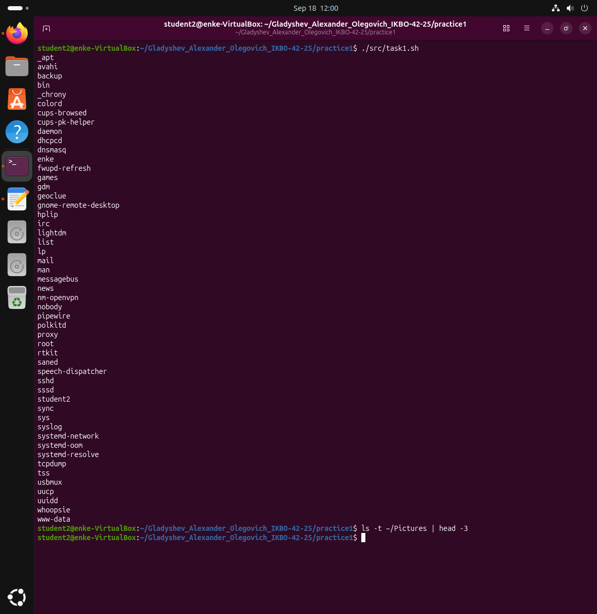

# Практическое занятие №1. Введение, основы работы в командной строке

**Выполнил:** Гладышев Александр Олегович, группа ИКБО-42-25
**РТУ МИРЭА, Институт информационных технологий, кафедра вычислительной техники**

**Цель работы:** научиться выполнять простые действия с файлами и каталогами
в Linux из командной строки; сравнить работу в командной строке Windows и Linux.

---

## Задача 1

**Условие.** Вывести отсортированный в алфавитном порядке список имён пользователей
в файле passwd (понадобится grep).

**Решение.** Имя пользователя — первое поле строки `/etc/passwd`, поля разделены
двоеточием. `grep -o '^[^:]\+'` вырезает всё от начала строки до первого двоеточия,
`sort` сортирует результат.

Файл [`src/task1.sh`](src/task1.sh):

```bash
#!/bin/bash
set -euo pipefail

PASSWD_FILE="${1:-/etc/passwd}"

grep -o '^[^:]\+' "$PASSWD_FILE" | sort
```

**Запуск:** `./src/task1.sh`


