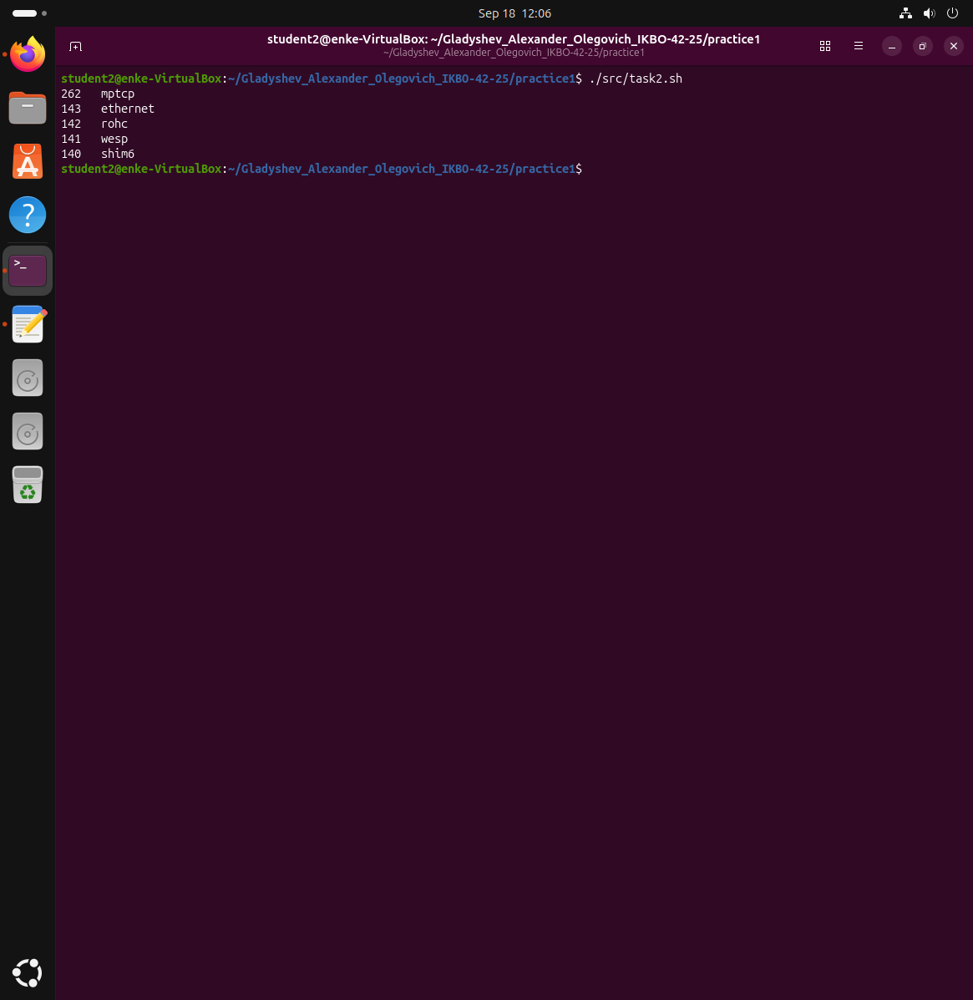
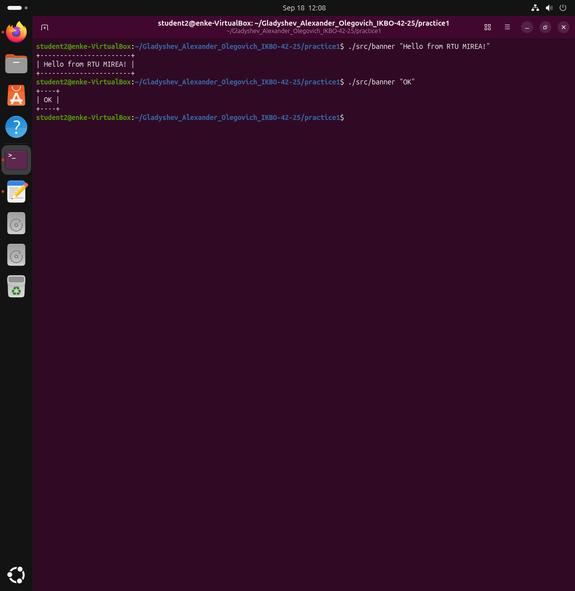
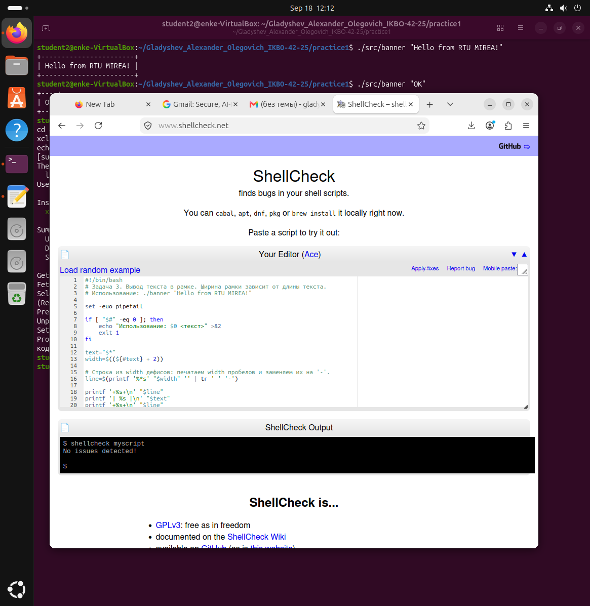
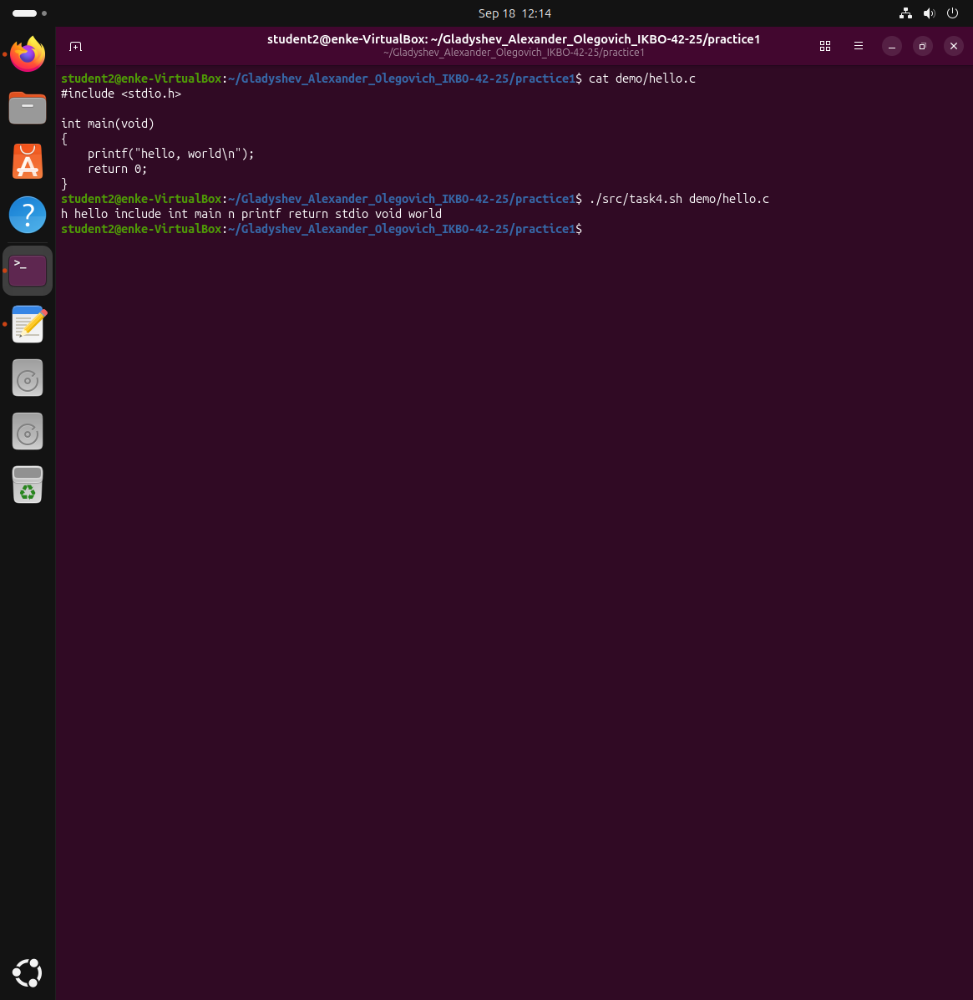
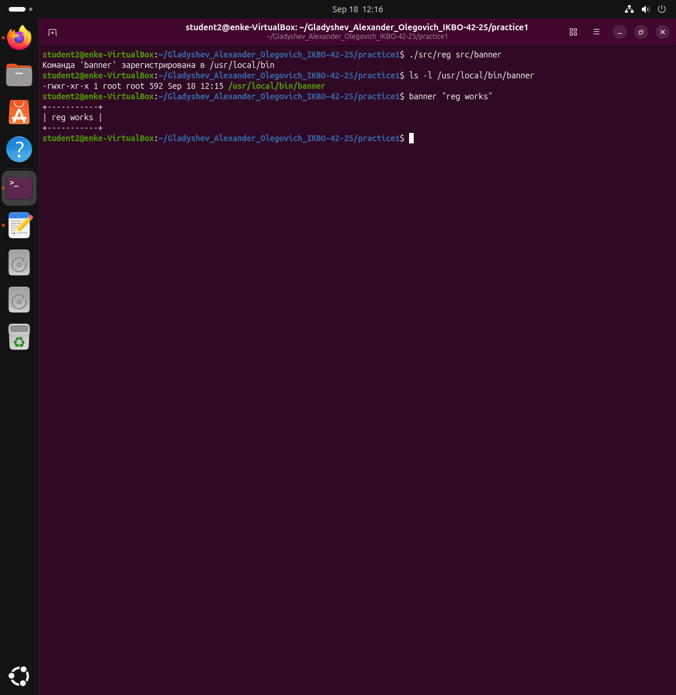
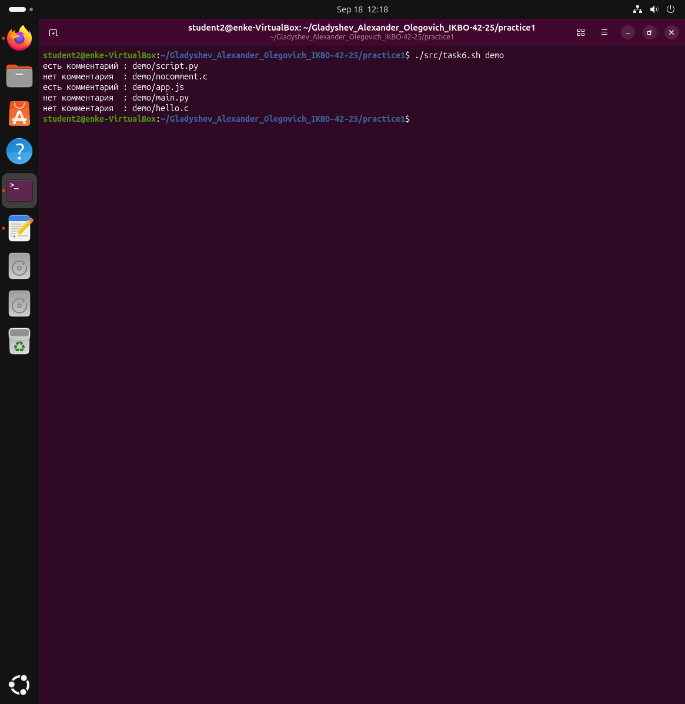
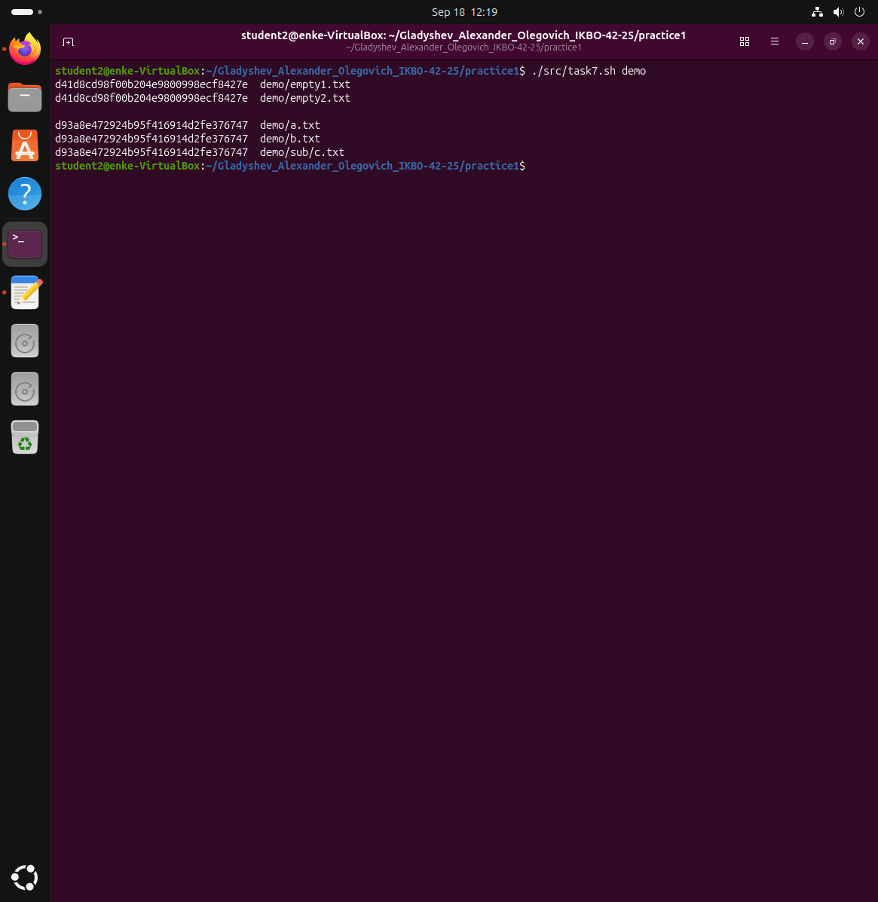

# Практическое занятие №1. Введение, основы работы в командной строке

**Выполнил:** Гладышев Александр Олегович, группа ИКБО-42-25
**РТУ МИРЭА, Институт информационных технологий, кафедра вычислительной техники**

**Цель работы:** научиться выполнять простые действия с файлами и каталогами
в Linux из командной строки; сравнить работу в командной строке Windows и Linux.

---

## Задача 1

**Условие.** Вывести отсортированный в алфавитном порядке список имён пользователей
в файле passwd (понадобится grep).

**Решение.** Имя пользователя — первое поле строки `/etc/passwd`, поля разделены
двоеточием. `grep -o '^[^:]\+'` вырезает всё от начала строки до первого двоеточия,
`sort` сортирует результат.

Файл [`src/task1.sh`](src/task1.sh):

```bash
#!/bin/bash
set -euo pipefail

PASSWD_FILE="${1:-/etc/passwd}"

grep -o '^[^:]\+' "$PASSWD_FILE" | sort
```

**Запуск:** `./src/task1.sh`


---

## Задача 2

**Условие.** Вывести данные `/etc/protocols` в отформатированном и отсортированном
порядке для 5 наибольших номеров.

**Решение.** Строки-комментарии (начинаются с `#`) отбрасываем через `grep -v`.
Формат файла — `<имя> <номер> <алиасы>`, поэтому `awk` меняет колонки местами
и выравнивает их через `printf`. `sort -k1,1nr` — числовая сортировка по убыванию,
`head -n 5` оставляет первые пять строк.

Файл [`src/task2.sh`](src/task2.sh):

```bash
#!/bin/bash
set -euo pipefail

PROTO_FILE="${2:-/etc/protocols}"
TOP="${1:-5}"

grep -v '^[[:space:]]*#' "$PROTO_FILE" \
    | awk 'NF >= 2 { printf "%-5s %s\n", $2, $1 }' \
    | sort -k1,1nr \
    | head -n "$TOP"
```

**Запуск:** `./src/task2.sh`



---

## Задача 3

**Условие.** Написать программу `banner` средствами bash для вывода текста в рамке;
размер баннера должен меняться.

**Решение.** Ширина рамки равна длине текста плюс два пробела по краям. Длина строки
берётся встроенным средством bash `${#text}`. Строка из дефисов получается так:
`printf '%*s'` печатает нужное количество пробелов, а `tr` заменяет их на `-`.

Файл [`src/banner`](src/banner):

```bash
#!/bin/bash
set -euo pipefail

if [ "$#" -eq 0 ]; then
    echo "Использование: $0 <текст>" >&2
    exit 1
fi

text="$*"
width=$((${#text} + 2))

line=$(printf '%*s' "$width" '' | tr ' ' '-')

printf '+%s+\n' "$line"
printf '| %s |\n' "$text"
printf '+%s+\n' "$line"
```

**Запуск:** `./src/banner "Hello from RTU MIREA!"` и `./src/banner "OK"`



**Проверка в ShellCheck.** Замечаний нет.



---

## Задача 4

**Условие.** Написать программу для вывода всех идентификаторов (по правилам C/C++
или Java) в файле, без повторений.

**Решение.** Идентификатор — буква или `_`, далее буквы, цифры, `_`. Это регулярное
выражение `[A-Za-z_][A-Za-z_0-9]*`. `grep -oE` выводит каждое совпадение с новой
строки, `sort -u` сортирует и убирает повторы, `tr '\n' ' '` склеивает результат
в одну строку.

Файл [`src/task4.sh`](src/task4.sh):

```bash
#!/bin/bash
set -euo pipefail

if [ "$#" -ne 1 ]; then
    echo "Использование: $0 <файл>" >&2
    exit 1
fi

grep -oE '[A-Za-z_][A-Za-z_0-9]*' "$1" | sort -u | tr '\n' ' '
echo
```

**Запуск:** `./src/task4.sh demo/hello.c`



Результат совпадает с примером из задания. Символы `h` и `n` попадают в список,
потому что это части `stdio.h` и `\n` — они тоже подходят под правило идентификатора.

---

## Задача 5

**Условие.** Написать программу для регистрации пользовательской команды —
правильные права доступа и копирование в `/usr/local/bin`.

**Решение.** `chmod 755` даёт владельцу чтение, запись и выполнение, остальным —
чтение и выполнение. Копирование в `/usr/local/bin` требует прав root, поэтому если
скрипт запущен не от root, используется `sudo`. Каталог `/usr/local/bin` входит
в `PATH`, поэтому зарегистрированная команда вызывается из любого места без `./`.

Файл [`src/reg`](src/reg):

```bash
#!/bin/bash
set -euo pipefail

BIN_DIR="/usr/local/bin"

if [ "$#" -ne 1 ]; then
    echo "Использование: $0 <файл-программы>" >&2
    exit 1
fi

prog="$1"

if [ ! -f "$prog" ]; then
    echo "Ошибка: файл '$prog' не найден" >&2
    exit 1
fi

chmod 755 "$prog"

if [ "$(id -u)" -eq 0 ]; then
    cp "$prog" "$BIN_DIR/"
else
    sudo cp "$prog" "$BIN_DIR/"
fi

echo "Команда '$(basename "$prog")' зарегистрирована в $BIN_DIR"
```

**Запуск:** `./src/reg src/banner`, затем проверка `banner "reg works"` без `./`



---

## Задача 6

**Условие.** Написать программу для проверки наличия комментария в первой строке
файлов с расширением c, js и py.

**Решение.** `find` собирает нужные файлы, `head -n 1` берёт первую строку.
Синтаксис комментария зависит от языка: в Python это `#`, в C и JavaScript — `//`
или `/*`. Ключ `-print0` у `find` и `read -r -d ''` нужны, чтобы корректно
обрабатывались имена файлов с пробелами.

Файл [`src/task6.sh`](src/task6.sh):

```bash
#!/bin/bash
set -euo pipefail

dir="${1:-.}"

if [ ! -d "$dir" ]; then
    echo "Ошибка: '$dir' не каталог" >&2
    exit 1
fi

find "$dir" -type f \( -name '*.c' -o -name '*.js' -o -name '*.py' \) -print0 \
| while IFS= read -r -d '' file; do
    first_line=$(head -n 1 "$file")

    case "$file" in
        *.py) pattern='^[[:space:]]*#' ;;
        *)    pattern='^[[:space:]]*(//|/\*)' ;;
    esac

    if printf '%s\n' "$first_line" | grep -Eq "$pattern"; then
        echo "есть комментарий : $file"
    else
        echo "нет комментария  : $file"
    fi
done
```

**Запуск:** `./src/task6.sh demo`



---

## Задача 7

**Условие.** Написать программу для нахождения файлов-дубликатов (имеющих 1 или более
копий содержимого) по заданному пути и подкаталогам.

**Решение.** Сравниваем не имена, а содержимое — через контрольную сумму MD5.
`md5sum` печатает строку `<32 символа хеша>  <путь>`, `sort` ставит одинаковые хеши
рядом, а `uniq -w32 --all-repeated=separate` сравнивает только первые 32 символа
(сам хеш), оставляет лишь повторяющиеся группы и разделяет их пустой строкой.

Файл [`src/task7.sh`](src/task7.sh):

```bash
#!/bin/bash
set -euo pipefail

dir="${1:-.}"

if [ ! -d "$dir" ]; then
    echo "Ошибка: '$dir' не каталог" >&2
    exit 1
fi

find "$dir" -type f -exec md5sum {} + \
    | sort \
    | uniq -w32 --all-repeated=separate
```

**Запуск:** `./src/task7.sh demo`



Найдены две группы дубликатов: два пустых файла и три файла с одинаковым текстом,
один из которых лежит в подкаталоге `sub` — поиск работает рекурсивно.
