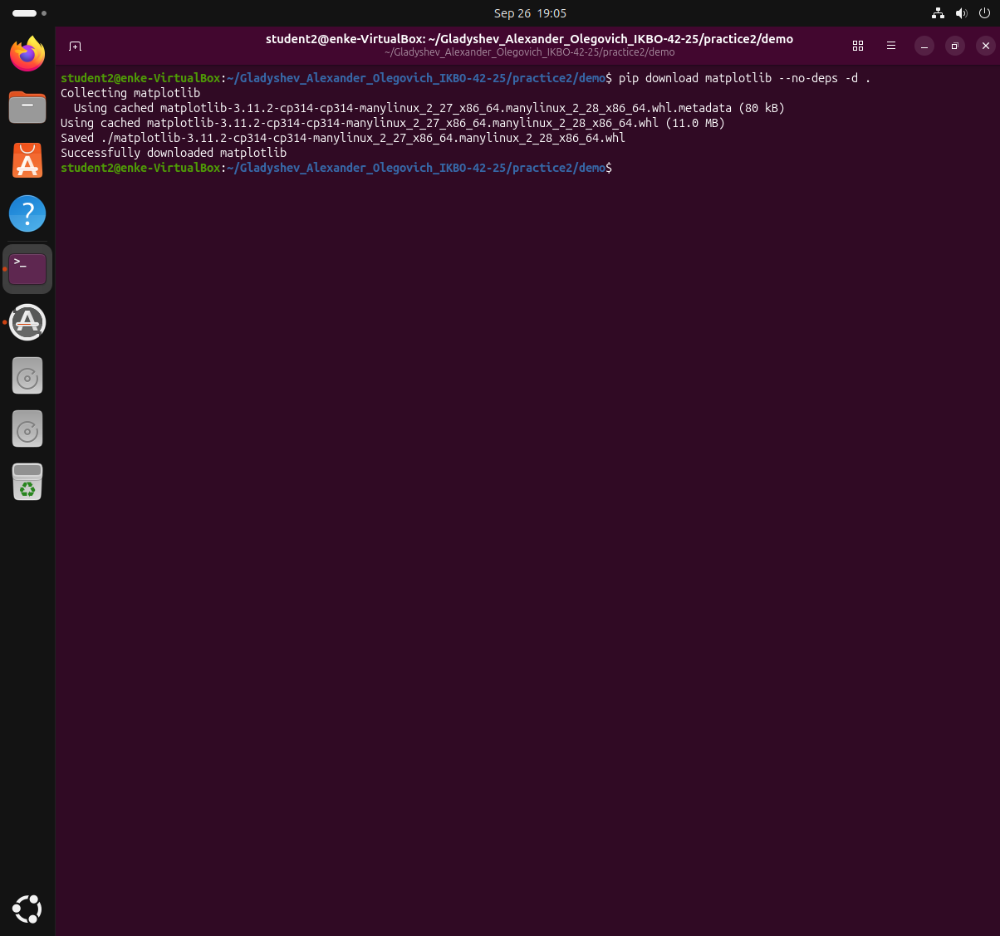
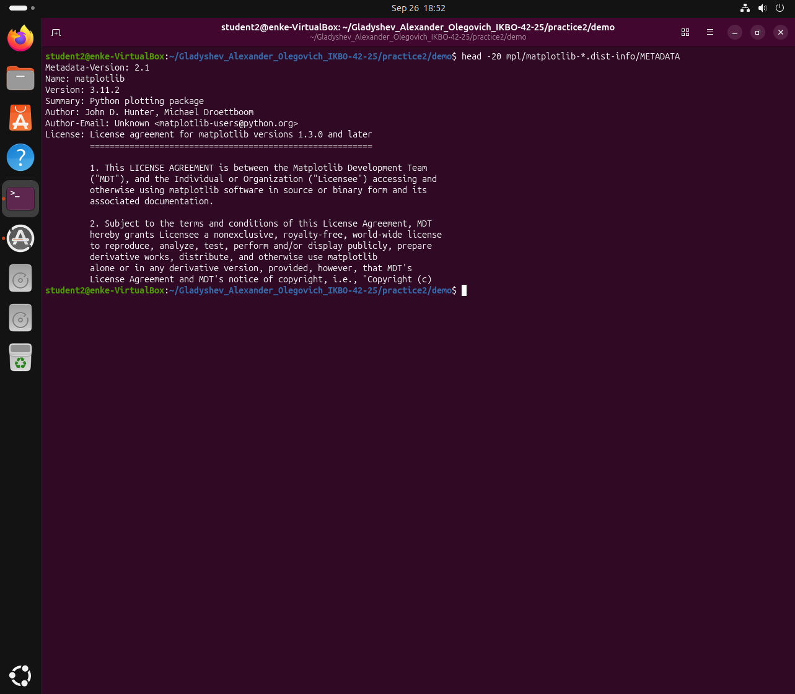
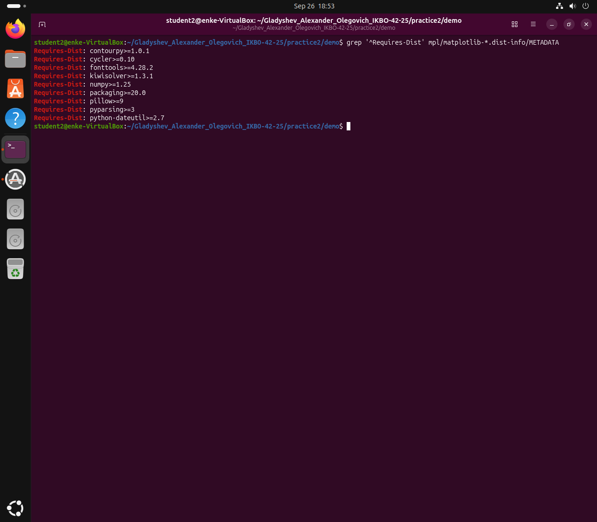
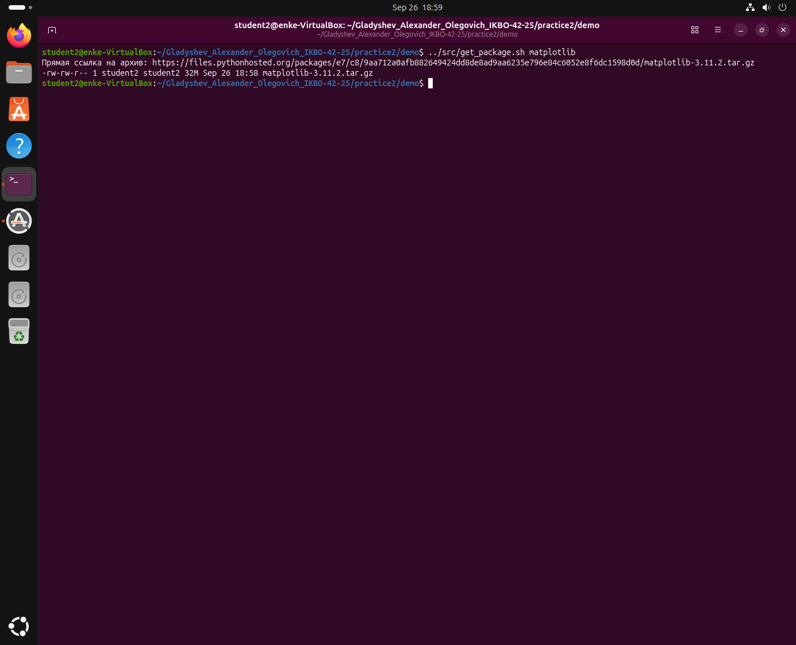
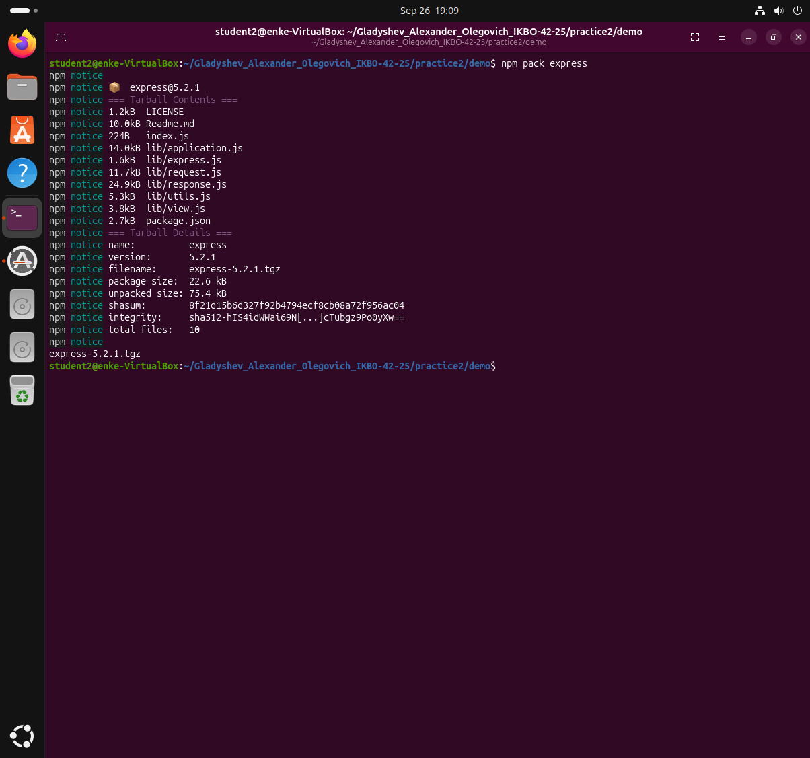
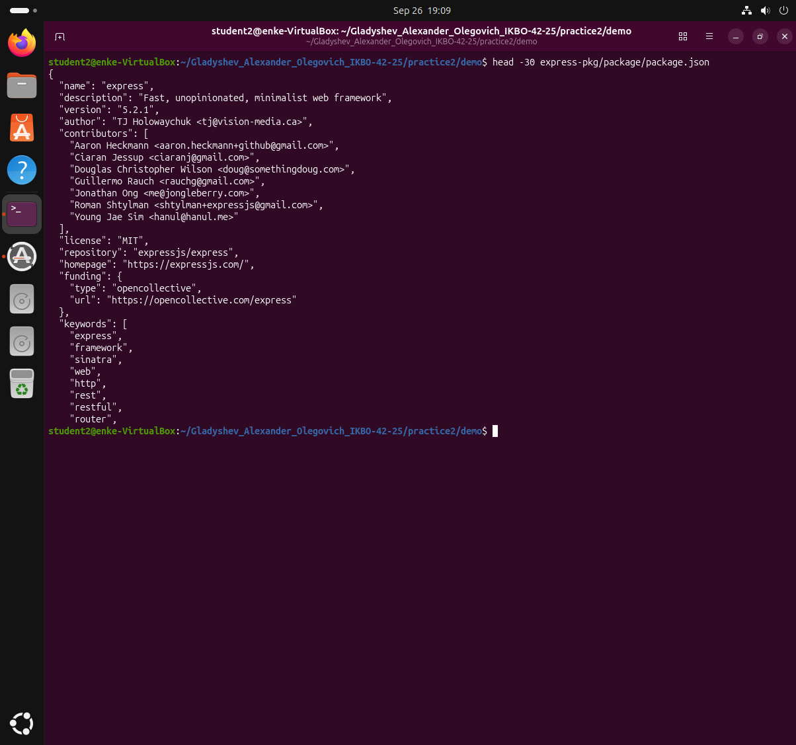
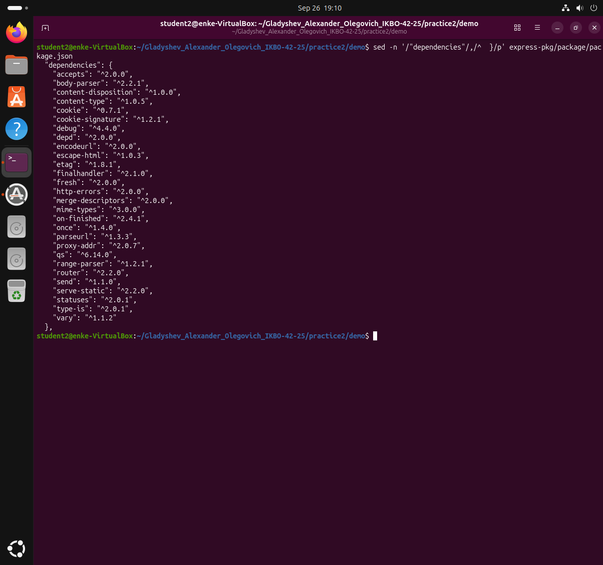
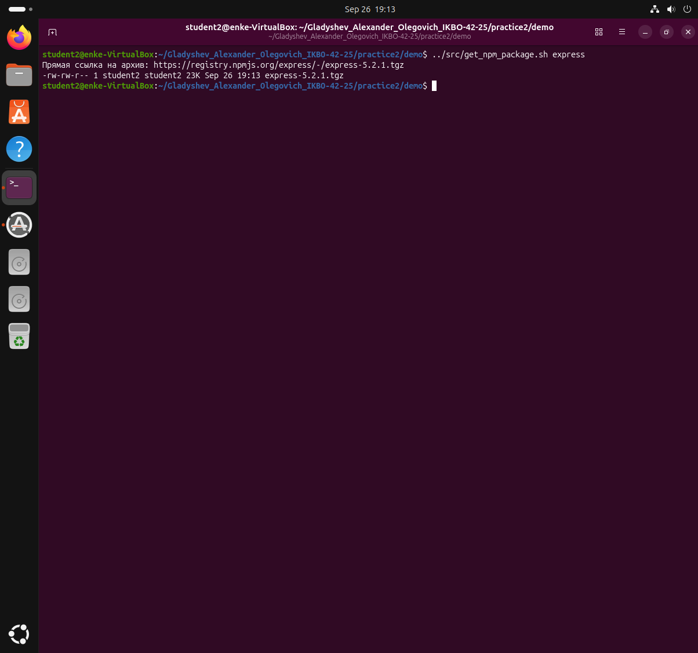

# Практическое занятие №2. Менеджеры пакетов

**Выполнил:** Гладышев Александр Олегович, группа ИКБО-42-25
**РТУ МИРЭА, Институт информационных технологий, кафедра вычислительной техники**

**Цель работы:** разобраться, что представляет собой менеджер пакетов, как устроен
пакет, как читать версии стандарта semver.

---

## Задача 1. Служебная информация о пакете matplotlib (Python)

**Условие.** Вывести служебную информацию о пакете matplotlib. Разобрать основные
элементы содержимого файла со служебной информацией. Как получить пакет без
менеджера пакетов, прямо из репозитория?

### Получение пакета через менеджер пакетов

Команда `pip download` скачивает пакет, не устанавливая его. Ключ `--no-deps`
означает «только сам пакет, без зависимостей».

**Запуск:** `pip download matplotlib --no-deps -d .`



Скачан файл `matplotlib-3.11.2-cp314-cp314-manylinux_2_27_x86_64.manylinux_2_28_x86_64.whl`.
Имя wheel-файла само по себе структурировано:

| Часть | Значение |
|---|---|
| `matplotlib` | имя пакета |
| `3.11.2` | версия |
| `cp314` | пакет собран для CPython 3.14 |
| `cp314` | версия ABI (двоичного интерфейса) |
| `manylinux_2_27_x86_64` | платформа: Linux с glibc 2.27+, архитектура x86-64 |

### Устройство пакета

Wheel — это обычный zip-архив, поэтому распаковывается командой `unzip`. Внутри
лежит сам код и каталог `matplotlib-3.11.2.dist-info` со служебной информацией.
Главный файл там — `METADATA`.

**Запуск:** `head -20 mpl/matplotlib-*.dist-info/METADATA`



Основные поля:

| Поле | Назначение |
|---|---|
| `Metadata-Version` | версия самого формата метаданных (здесь 2.1) |
| `Name` | имя пакета в репозитории |
| `Version` | версия пакета по стандарту semver |
| `Summary` | однострочное описание |
| `Author`, `Author-Email` | автор и контакт |
| `License` | текст лицензии |
| `Classifier` | категории для каталога PyPI (язык, ОС, стадия разработки) |
| `Requires-Python` | минимальная версия интерпретатора |
| `Requires-Dist` | зависимости с ограничениями на версии |
| `Provides-Extra` | необязательные наборы зависимостей |

### Версия по semver

`3.11.2` читается как `MAJOR.MINOR.PATCH`:

* `MAJOR` = 3 — меняется при несовместимых изменениях API;
* `MINOR` = 11 — новая функциональность с сохранением совместимости;
* `PATCH` = 2 — исправления ошибок без изменения поведения.

### Зависимости

**Запуск:** `grep '^Requires-Dist' mpl/matplotlib-*.dist-info/METADATA`



Девять прямых зависимостей: `contourpy>=1.0.1`, `cycler>=0.10`, `fonttools>=4.28.2`,
`kiwisolver>=1.3.1`, `numpy>=1.25`, `packaging>=20.0`, `pillow>=9`, `pyparsing>=3`,
`python-dateutil>=2.7`.

Запись `numpy>=1.25` — это ограничение на версию: подойдёт любая версия numpy
не ниже 1.25. Именно такие ограничения менеджер пакетов и решает при установке,
подбирая версии, устраивающие всех сразу.

### Как получить пакет без менеджера пакетов

PyPI — это обычный HTTP-сервис. У него есть JSON API по адресу
`https://pypi.org/pypi/<пакет>/json`, где перечислены прямые ссылки на файлы
релиза. Взяв оттуда ссылку, архив можно скачать обычным `curl`, без pip.

Файл [`src/get_package.sh`](src/get_package.sh):

```bash
#!/bin/bash
set -euo pipefail

pkg="${1:-matplotlib}"
meta=$(mktemp)

curl -s "https://pypi.org/pypi/${pkg}/json" -o "$meta"

url=$(python3 -c "
import json
d = json.load(open('$meta'))
print(next(u['url'] for u in d['urls'] if u['packagetype'] == 'sdist'))
")

echo "Прямая ссылка на архив: $url"
curl -sL -O "$url"
ls -lh "$(basename "$url")"

rm -f "$meta"
```

**Запуск:** `../src/get_package.sh matplotlib`



Скачан архив с исходниками `matplotlib-3.11.2.tar.gz` размером 32 МБ. Второй
способ — взять исходный код прямо из системы контроля версий проекта:
`git clone https://github.com/matplotlib/matplotlib`. Разница в том, что менеджер
пакетов при этом не участвует: зависимости придётся ставить вручную, а пакет —
собирать самому.

---

## Задача 2. Служебная информация о пакете express (JavaScript)

**Условие.** Вывести служебную информацию о пакете express. Разобрать основные
элементы содержимого файла со служебной информацией. Как получить пакет без
менеджера пакетов, прямо из репозитория?

### Получение пакета через менеджер пакетов

В экосистеме Node.js менеджер пакетов — `npm`, реестр — `registry.npmjs.org`.
Аналог `pip download` здесь — команда `npm pack`: она забирает из реестра архив
пакета и кладёт рядом, ничего не устанавливая.

**Запуск:** `npm pack express`



Скачан `express-5.2.1.tgz` размером 22.6 КБ, внутри 10 файлов. Формат архива —
`.tgz`, то есть tar, сжатый gzip, в отличие от zip-архива wheel у Python.
Распаковывается командой `tar -xzf`, всё содержимое лежит в папке `package` —
это соглашение npm.

### Устройство пакета

Файл со служебной информацией у npm называется `package.json` и лежит в корне
пакета. В отличие от `METADATA` у Python это не текст «ключ: значение», а
полноценный JSON.

**Запуск:** `head -30 express-pkg/package/package.json`



Основные поля:

| Поле | Назначение |
|---|---|
| `name` | имя пакета в реестре |
| `version` | версия по стандарту semver |
| `description` | краткое описание |
| `author`, `contributors` | автор и список соавторов |
| `license` | лицензия (здесь MIT) |
| `repository` | репозиторий с исходным кодом |
| `homepage` | сайт проекта |
| `keywords` | ключевые слова для поиска в реестре |
| `main` | точка входа — файл, который подключается при `require` |
| `dependencies` | зависимости для работы пакета |
| `devDependencies` | зависимости только для разработки, пользователю не ставятся |
| `engines` | требования к версии Node.js |
| `scripts` | команды сборки, тестов и запуска |

Принципиальное отличие от Python: npm разделяет обычные зависимости и зависимости
разработки. Первые ставятся всем, вторые — только тем, кто разрабатывает сам пакет.

### Зависимости

**Запуск:** `sed -n '/"dependencies"/,/^  }/p' express-pkg/package/package.json`



У express 28 прямых зависимостей против девяти у matplotlib. Это отражает подход
экосистемы Node.js: много мелких пакетов, каждый решает одну задачу.

Запись вида `^2.0.0` — это ограничение semver с оператором «карет». Оно означает
«любая версия, не меняющая старший разряд»:

| Запись | Допустимые версии |
|---|---|
| `^2.0.0` | от 2.0.0 до 3.0.0, не включая 3.0.0 |
| `^1.2.1` | от 1.2.1 до 2.0.0, не включая 2.0.0 |
| `^0.7.1` | от 0.7.1 до 0.8.0, не включая 0.8.0 |

Последняя строка — особый случай: у версий `0.x` каждая смена среднего разряда
считается несовместимой, потому что пакет ещё не стабилизирован.

### Как получить пакет без менеджера пакетов

Реестр npm тоже обычный HTTP-сервис. По адресу `https://registry.npmjs.org/<пакет>`
он отдаёт JSON со всеми версиями пакета. В поле `dist.tarball` каждой версии лежит
прямая ссылка на архив, который скачивается обычным `curl`.

Файл [`src/get_npm_package.sh`](src/get_npm_package.sh):

```bash
#!/bin/bash
set -euo pipefail

pkg="${1:-express}"
meta=$(mktemp)

curl -s "https://registry.npmjs.org/${pkg}" -o "$meta"

url=$(python3 -c "
import json
d = json.load(open('$meta'))
latest = d['dist-tags']['latest']
print(d['versions'][latest]['dist']['tarball'])
")

echo "Прямая ссылка на архив: $url"
curl -sL -O "$url"
ls -lh "$(basename "$url")"

rm -f "$meta"
```

**Запуск:** `../src/get_npm_package.sh express`



Получена прямая ссылка `https://registry.npmjs.org/express/-/express-5.2.1.tgz`
и скачан архив 23 КБ, без участия npm. Второй способ — взять исходники из
репозитория проекта: `git clone https://github.com/expressjs/express`.
