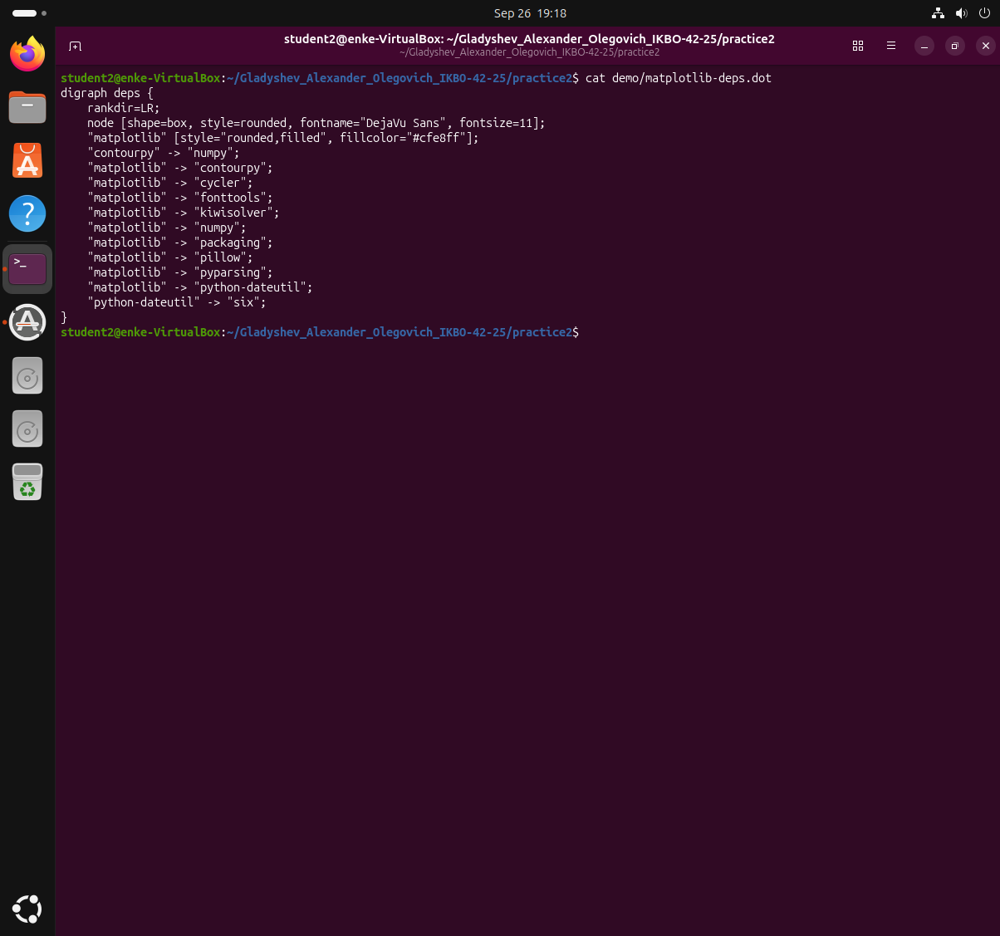
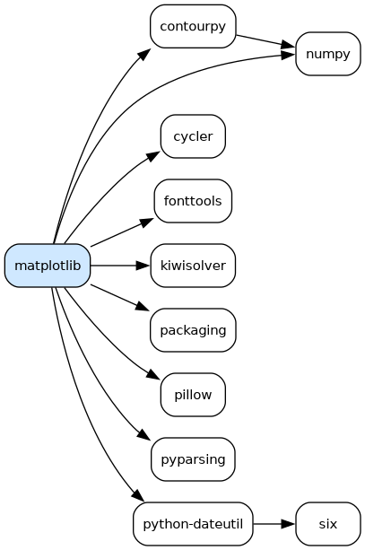
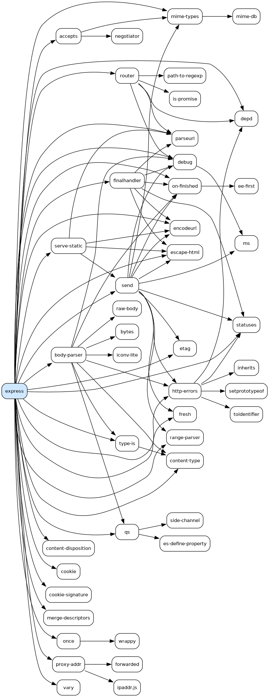
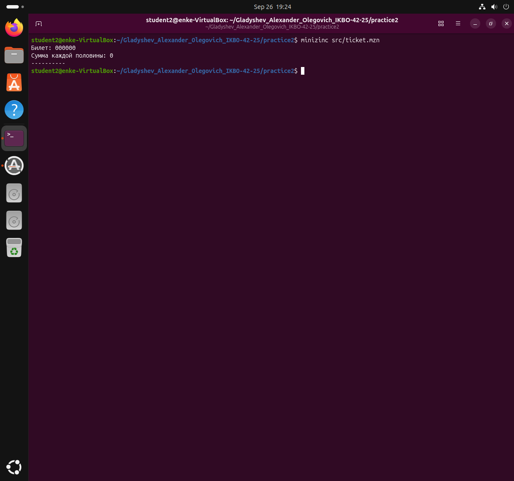
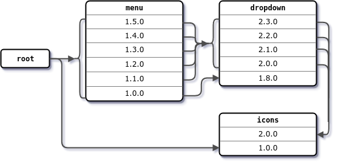
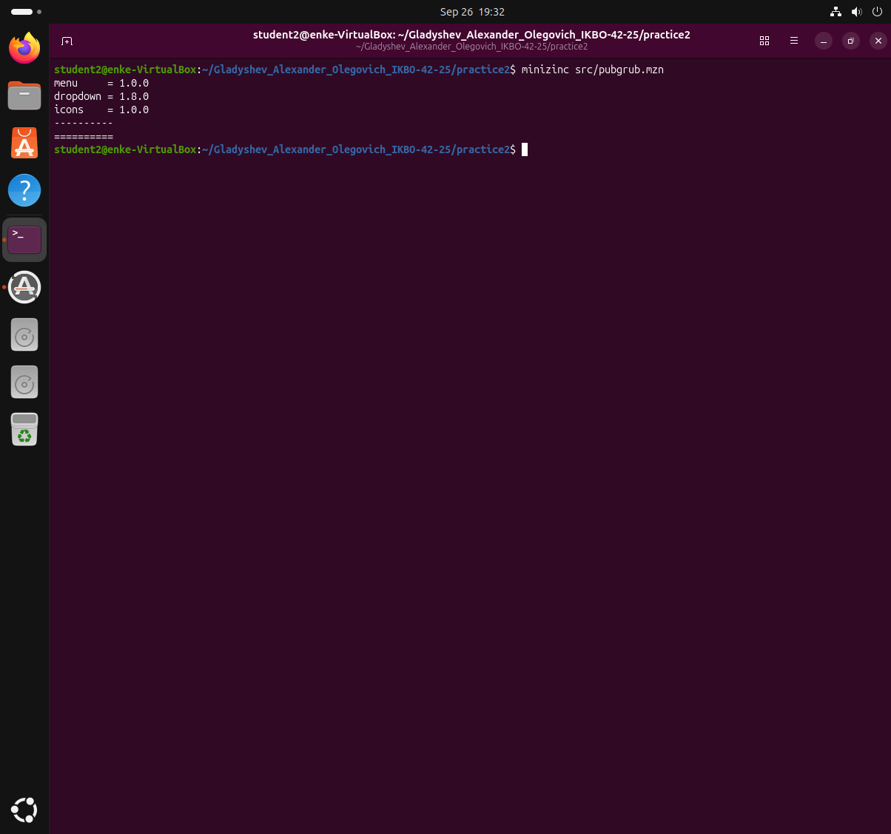
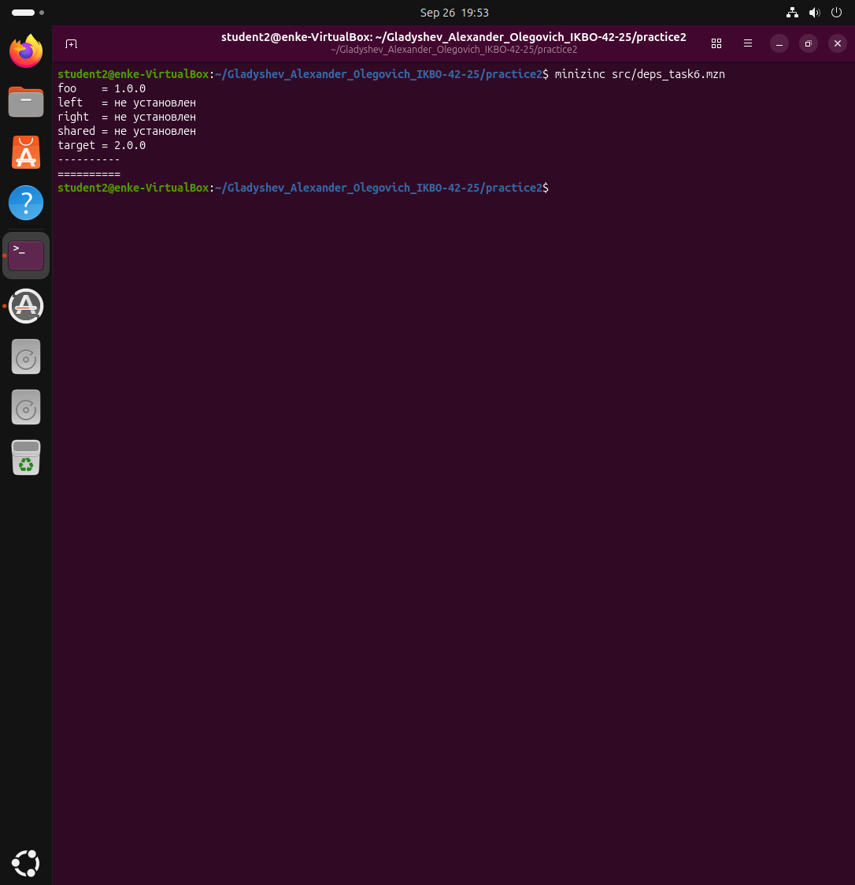
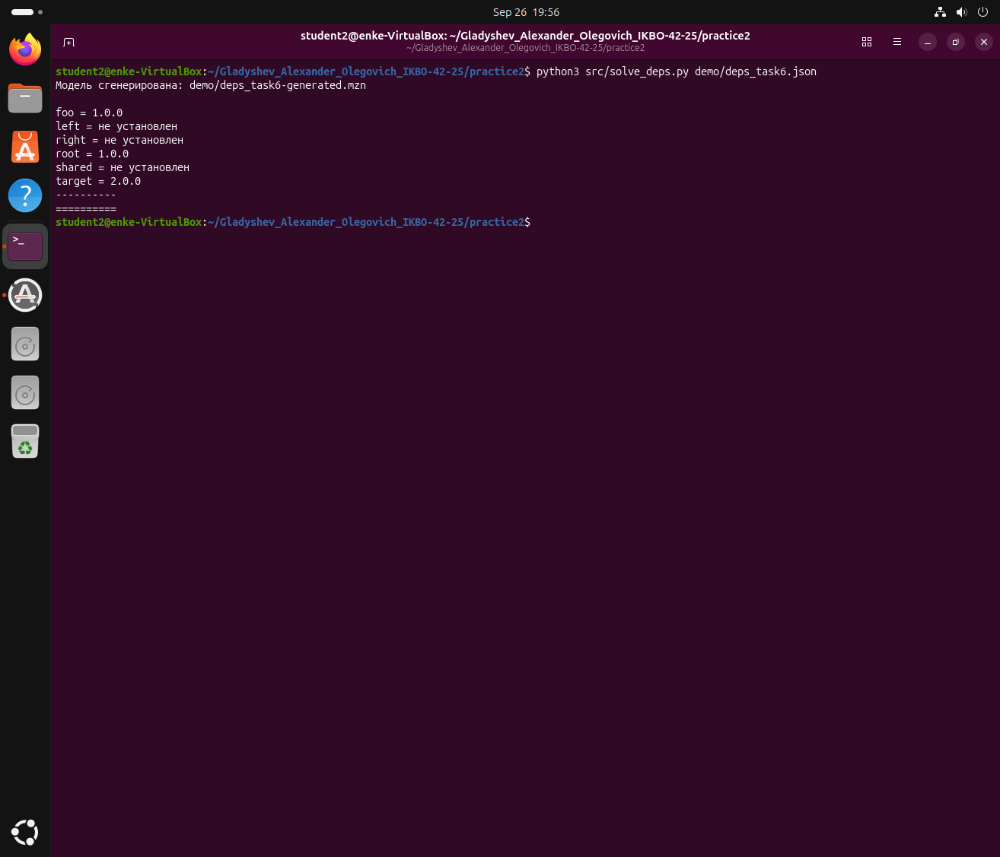
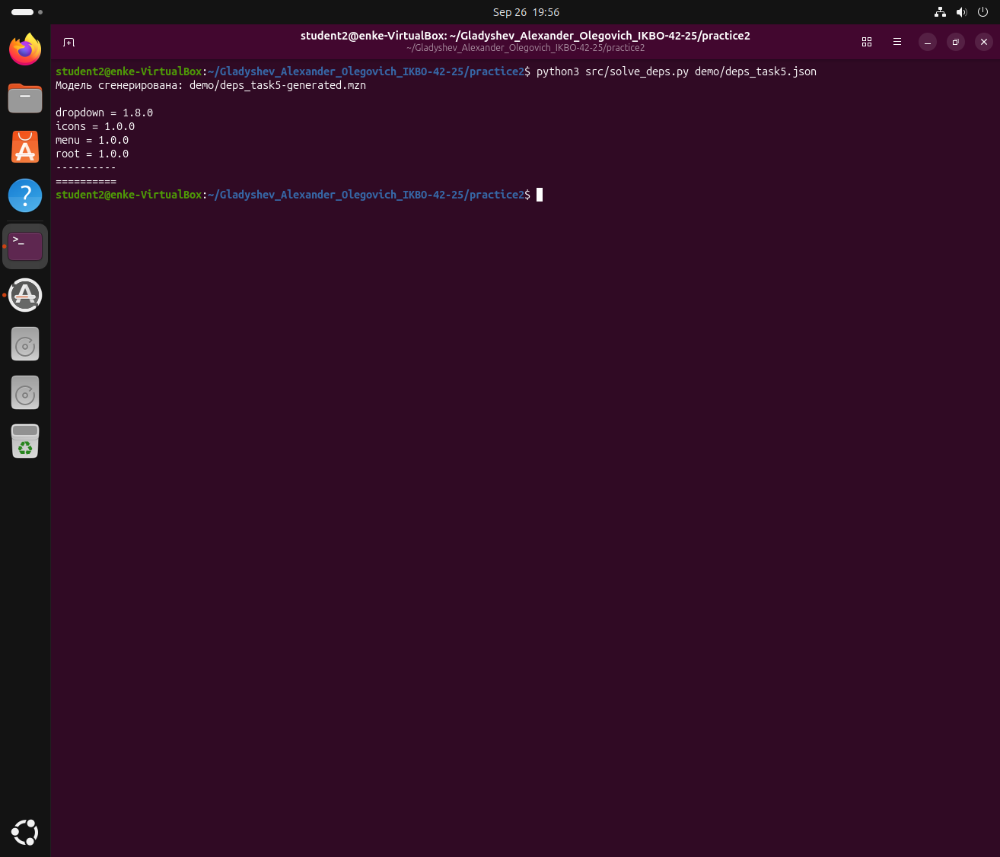

# Практическое занятие №2. Менеджеры пакетов

**Выполнил:** Гладышев Александр Олегович, группа ИКБО-42-25
**РТУ МИРЭА, Институт информационных технологий, кафедра вычислительной техники**

**Цель работы:** разобраться, что представляет собой менеджер пакетов, как устроен
пакет, как читать версии стандарта semver.

---

## Задача 1. Служебная информация о пакете matplotlib (Python)

**Условие.** Вывести служебную информацию о пакете matplotlib. Разобрать основные
элементы содержимого файла со служебной информацией. Как получить пакет без
менеджера пакетов, прямо из репозитория?

### Получение пакета через менеджер пакетов

Команда `pip download` скачивает пакет, не устанавливая его. Ключ `--no-deps`
означает «только сам пакет, без зависимостей».

**Запуск:** `pip download matplotlib --no-deps -d .`


Скачан файл `matplotlib-3.11.2-cp314-cp314-manylinux_2_27_x86_64.manylinux_2_28_x86_64.whl`.
Имя wheel-файла само по себе структурировано:

| Часть | Значение |
|---|---|
| `matplotlib` | имя пакета |
| `3.11.2` | версия |
| `cp314` | пакет собран для CPython 3.14 |
| `cp314` | версия ABI (двоичного интерфейса) |
| `manylinux_2_27_x86_64` | платформа: Linux с glibc 2.27+, архитектура x86-64 |

### Устройство пакета

Wheel — это обычный zip-архив, поэтому распаковывается командой `unzip`. Внутри
лежит сам код и каталог `matplotlib-3.11.2.dist-info` со служебной информацией.
Главный файл там — `METADATA`.

**Запуск:** `head -20 mpl/matplotlib-*.dist-info/METADATA`


Основные поля:

| Поле | Назначение |
|---|---|
| `Metadata-Version` | версия самого формата метаданных (здесь 2.1) |
| `Name` | имя пакета в репозитории |
| `Version` | версия пакета по стандарту semver |
| `Summary` | однострочное описание |
| `Author`, `Author-Email` | автор и контакт |
| `License` | текст лицензии |
| `Classifier` | категории для каталога PyPI (язык, ОС, стадия разработки) |
| `Requires-Python` | минимальная версия интерпретатора |
| `Requires-Dist` | зависимости с ограничениями на версии |
| `Provides-Extra` | необязательные наборы зависимостей |

### Версия по semver

`3.11.2` читается как `MAJOR.MINOR.PATCH`:

* `MAJOR` = 3 — меняется при несовместимых изменениях API;
* `MINOR` = 11 — новая функциональность с сохранением совместимости;
* `PATCH` = 2 — исправления ошибок без изменения поведения.

### Зависимости

**Запуск:** `grep '^Requires-Dist' mpl/matplotlib-*.dist-info/METADATA`


Девять прямых зависимостей: `contourpy>=1.0.1`, `cycler>=0.10`, `fonttools>=4.28.2`,
`kiwisolver>=1.3.1`, `numpy>=1.25`, `packaging>=20.0`, `pillow>=9`, `pyparsing>=3`,
`python-dateutil>=2.7`.

Запись `numpy>=1.25` — это ограничение на версию: подойдёт любая версия numpy
не ниже 1.25. Именно такие ограничения менеджер пакетов и решает при установке,
подбирая версии, устраивающие всех сразу.

### Как получить пакет без менеджера пакетов

PyPI — это обычный HTTP-сервис. У него есть JSON API по адресу
`https://pypi.org/pypi/<пакет>/json`, где перечислены прямые ссылки на файлы
релиза. Взяв оттуда ссылку, архив можно скачать обычным `curl`, без pip.

Файл [`src/get_package.sh`](src/get_package.sh):

```bash
#!/bin/bash
set -euo pipefail

pkg="${1:-matplotlib}"
meta=$(mktemp)

curl -s "https://pypi.org/pypi/${pkg}/json" -o "$meta"

url=$(python3 -c "
import json
d = json.load(open('$meta'))
print(next(u['url'] for u in d['urls'] if u['packagetype'] == 'sdist'))
")

echo "Прямая ссылка на архив: $url"
curl -sL -O "$url"
ls -lh "$(basename "$url")"

rm -f "$meta"
```

**Запуск:** `../src/get_package.sh matplotlib`


Скачан архив с исходниками `matplotlib-3.11.2.tar.gz` размером 32 МБ. Второй
способ — взять исходный код прямо из системы контроля версий проекта:
`git clone https://github.com/matplotlib/matplotlib`. Разница в том, что менеджер
пакетов при этом не участвует: зависимости придётся ставить вручную, а пакет —
собирать самому.

---

## Задача 2. Служебная информация о пакете express (JavaScript)

**Условие.** Вывести служебную информацию о пакете express. Разобрать основные
элементы содержимого файла со служебной информацией. Как получить пакет без
менеджера пакетов, прямо из репозитория?

### Получение пакета через менеджер пакетов

В экосистеме Node.js менеджер пакетов — `npm`, реестр — `registry.npmjs.org`.
Аналог `pip download` здесь — команда `npm pack`: она забирает из реестра архив
пакета и кладёт рядом, ничего не устанавливая.

**Запуск:** `npm pack express`


Скачан `express-5.2.1.tgz` размером 22.6 КБ, внутри 10 файлов. Формат архива —
`.tgz`, то есть tar, сжатый gzip, в отличие от zip-архива wheel у Python.
Распаковывается командой `tar -xzf`, всё содержимое лежит в папке `package` —
это соглашение npm.

### Устройство пакета

Файл со служебной информацией у npm называется `package.json` и лежит в корне
пакета. В отличие от `METADATA` у Python это не текст «ключ: значение», а
полноценный JSON.

**Запуск:** `head -30 express-pkg/package/package.json`


Основные поля:

| Поле | Назначение |
|---|---|
| `name` | имя пакета в реестре |
| `version` | версия по стандарту semver |
| `description` | краткое описание |
| `author`, `contributors` | автор и список соавторов |
| `license` | лицензия (здесь MIT) |
| `repository` | репозиторий с исходным кодом |
| `homepage` | сайт проекта |
| `keywords` | ключевые слова для поиска в реестре |
| `main` | точка входа — файл, который подключается при `require` |
| `dependencies` | зависимости для работы пакета |
| `devDependencies` | зависимости только для разработки, пользователю не ставятся |
| `engines` | требования к версии Node.js |
| `scripts` | команды сборки, тестов и запуска |

Принципиальное отличие от Python: npm разделяет обычные зависимости и зависимости
разработки. Первые ставятся всем, вторые — только тем, кто разрабатывает сам пакет.

### Зависимости

**Запуск:** `sed -n '/"dependencies"/,/^  }/p' express-pkg/package/package.json`


У express 28 прямых зависимостей против девяти у matplotlib. Это отражает подход
экосистемы Node.js: много мелких пакетов, каждый решает одну задачу.

Запись вида `^2.0.0` — это ограничение semver с оператором «карет». Оно означает
«любая версия, не меняющая старший разряд»:

| Запись | Допустимые версии |
|---|---|
| `^2.0.0` | от 2.0.0 до 3.0.0, не включая 3.0.0 |
| `^1.2.1` | от 1.2.1 до 2.0.0, не включая 2.0.0 |
| `^0.7.1` | от 0.7.1 до 0.8.0, не включая 0.8.0 |

Последняя строка — особый случай: у версий `0.x` каждая смена среднего разряда
считается несовместимой, потому что пакет ещё не стабилизирован.

### Как получить пакет без менеджера пакетов

Реестр npm тоже обычный HTTP-сервис. По адресу `https://registry.npmjs.org/<пакет>`
он отдаёт JSON со всеми версиями пакета. В поле `dist.tarball` каждой версии лежит
прямая ссылка на архив, который скачивается обычным `curl`.

Файл [`src/get_npm_package.sh`](src/get_npm_package.sh):

```bash
#!/bin/bash
set -euo pipefail

pkg="${1:-express}"
meta=$(mktemp)

curl -s "https://registry.npmjs.org/${pkg}" -o "$meta"

url=$(python3 -c "
import json
d = json.load(open('$meta'))
latest = d['dist-tags']['latest']
print(d['versions'][latest]['dist']['tarball'])
")

echo "Прямая ссылка на архив: $url"
curl -sL -O "$url"
ls -lh "$(basename "$url")"

rm -f "$meta"
```

**Запуск:** `../src/get_npm_package.sh express`


Получена прямая ссылка `https://registry.npmjs.org/express/-/express-5.2.1.tgz`
и скачан архив 23 КБ, без участия npm. Второй способ — взять исходники из
репозитория проекта: `git clone https://github.com/expressjs/express`.

---

## Задача 3. Графы зависимостей matplotlib и express

**Условие.** Сформировать graphviz-код и получить изображения зависимостей
matplotlib и express.

### Инструмент

Graphviz — программа для автоматической отрисовки графов. Граф описывается
текстом на языке DOT: `digraph` задаёт ориентированный граф, строка
`"a" -> "b";` — ребро от узла `a` к узлу `b`. Раскладку вершин graphviz
подбирает сам, команда `dot -Tpng` превращает описание в картинку.

### Генерация DOT-кода по метаданным

Писать описание графа руками не нужно — его строят два скрипта по тем же
метаданным, которые разбирались в задачах 1 и 2:

* [`src/deps_pypi.py`](src/deps_pypi.py) — берёт поле `info.requires_dist`
  из JSON, который PyPI отдаёт по адресу `https://pypi.org/pypi/<пакет>/json`;
* [`src/deps_npm.py`](src/deps_npm.py) — берёт поле `dependencies` последней
  версии из JSON реестра `https://registry.npmjs.org/<пакет>`.

Алгоритм у обоих одинаковый: обход в глубину с ограничением на уровень
вложенности. Для каждого пакета запрашиваются его прямые зависимости, на каждую
добавляется ребро, затем процедура повторяется для зависимости. Множество
`visited` не даёт зациклиться, если в графе есть цикл или повторный путь к пакету.

У версии для PyPI есть особенность: в `requires_dist` попадают и необязательные
зависимости с пометкой вида `extra ==` — они нужны только для сборки
документации или тестов. Такие строки отбрасываются, иначе граф разрастается
служебными пакетами. У npm эта проблема решена на уровне формата: обычные
зависимости и `devDependencies` лежат в разных полях.

**Запуск:** `python3 src/deps_pypi.py matplotlib 2 > demo/matplotlib-deps.dot`



### Граф зависимостей matplotlib

Файл [`demo/matplotlib-deps.dot`](demo/matplotlib-deps.dot), картинка получена
командой `dot -Tpng demo/matplotlib-deps.dot -o screens/deps-matplotlib.png`.



Граф компактный: девять прямых зависимостей, и почти все они сами ни от чего
не зависят. Второй уровень дают только `contourpy`, которому нужен `numpy`,
и `python-dateutil`, которому нужен `six`. Стоит обратить внимание на `numpy`:
к нему ведут два ребра — напрямую от matplotlib и через contourpy. Именно такие
общие зависимости менеджер пакетов и обязан согласовывать, подбирая одну версию,
устраивающую обоих.

### Граф зависимостей express

Файл [`demo/express-deps.dot`](demo/express-deps.dot), картинка получена
командой `dot -Tpng demo/express-deps.dot -o screens/deps-express.png`.



Здесь картина принципиально другая: 28 прямых зависимостей и около 79 рёбер на
той же глубине 2. Это следствие подхода экосистемы Node.js — много мелких
пакетов, каждый решает ровно одну задачу. Общих зависимостей тоже заметно
больше: `debug`, `statuses`, `depd`, `mime-types` подтягиваются сразу
несколькими соседями, и к ним сходится по нескольку стрелок.

### Вывод по задаче

Оба графа построены по одному принципу, хотя форматы метаданных разные. Это и
есть главная мысль: менеджер пакетов работает не с кодом, а с описанием пакета,
и задача разрешения зависимостей сводится к обходу графа и согласованию
ограничений на версии в его узлах.

---

## Задача 4. MiniZinc и задача о счастливых билетах

**Условие.** Изучить основы программирования в ограничениях. Установить MiniZinc,
разобраться с синтаксисом. Решить задачу о счастливых билетах, добавить ограничение
на различие всех цифр, найти минимальное решение для суммы 3 цифр.

### Программирование в ограничениях

До этого момента все решения были императивными: программа описывала
последовательность шагов. MiniZinc — декларативный язык. В нём не пишется алгоритм
поиска: описываются переменные решения, их области значений и ограничения, которым
решение обязано удовлетворять. Перебором занимается решатель.

Основные конструкции языка:

| Конструкция | Значение |
|---|---|
| `var 0..9: x` | переменная решения, значение из диапазона 0..9 |
| `array[1..6] of var 0..9: d` | массив из шести таких переменных |
| `constraint <выражение>` | ограничение, которое должно выполняться |
| `solve satisfy` | найти любое допустимое решение |
| `solve minimize x` | найти решение с наименьшим значением `x` |
| `include "globals.mzn"` | подключение библиотеки глобальных ограничений |
| `all_different(d)` | все элементы массива попарно различны |

Установка: `sudo apt install minizinc`, запуск модели: `minizinc <файл.mzn>`.

### Базовая модель

Билет из шести цифр считается счастливым, если сумма первых трёх цифр равна сумме
последних трёх. Модель [`src/ticket.mzn`](src/ticket.mzn) описывает ровно это: шесть
переменных с областью значений 0..9 и одно ограничение на равенство сумм.

**Запуск:** `minizinc src/ticket.mzn`



Решатель вернул билет `000000`. Формально это корректное решение: 0 равно 0. Здесь
хорошо видна природа `solve satisfy` — возвращается любое решение, удовлетворяющее
ограничениям, а не самое интересное. Чтобы получить осмысленный ответ, ограничения
нужно уточнять.

### Модель с ограничением на различие цифр и минимизацией

В модели [`src/ticket_min.mzn`](src/ticket_min.mzn) добавлены две вещи. Глобальное
ограничение `all_different(d)` требует, чтобы все шесть цифр были попарно различны —
это сразу отсекает вырожденные решения вроде `000000`. Отдельная переменная `s`
хранит сумму половины, а `solve minimize s` заставляет решатель искать не любое
решение, а решение с наименьшей суммой.

**Запуск:** `minizinc src/ticket_min.mzn`


Ответ: билет `620431`, сумма каждой половины равна 8. Строка `==========` в конце
вывода означает, что решатель доказал оптимальность найденного решения — меньшей
суммы не существует.

Результат проверяется и рассуждением. Сумма всех шести различных цифр равна `2s`,
то есть обязана быть чётной. Шесть наименьших различных цифр `0..5` дают в сумме 15,
число нечётное, поэтому такой набор не подходит. Ближайший подходящий набор —
`{0, 1, 2, 3, 4, 6}` с суммой 16, откуда `s = 8`. Разбиение на половины:
`6 + 2 + 0 = 8` и `4 + 3 + 1 = 8`, что и выдал решатель.

---

## Задача 5. Разрешение зависимостей по схеме из задания

**Условие.** Решить на MiniZinc задачу о зависимостях пакетов для схемы,
приведённой в задании.

### Исходные данные



Схема читается так:

| Пакет и версии | От чего зависит |
|---|---|
| `root` | `menu ^1.0.0` и `icons ^1.0.0` |
| `menu` 1.1.0 … 1.5.0 | `dropdown ^2.0.0` |
| `menu` 1.0.0 | `dropdown ^1.8.0` |
| `dropdown` 2.0.0 … 2.3.0 | `icons ^2.0.0` |
| `dropdown` 1.8.0 | `icons ^1.0.0` |
| `icons` 1.0.0, 2.0.0 | зависимостей нет |

Это известный пример конфликта версий из документации менеджера пакетов pubgrub.
Ловушка в том, что `root` требует `icons ^1.0.0`, а это ограничение исключает
`icons 2.0.0`. Значит, нельзя взять ни одну версию `dropdown` из двойки, потому
что все они тянут `icons ^2.0.0`. А раз `dropdown` обязан быть 1.8.0, то и `menu`
приходится откатить до 1.0.0 — единственной версии, которая с ним совместима.
Наивный алгоритм «бери всегда самую свежую версию» здесь сломается: он выберет
`menu 1.5.0` и зайдёт в тупик.

### Модель

Версии пакета упорядочены, поэтому их можно закодировать порядковыми номерами —
тогда ограничение на диапазон версий превращается в обычное сравнение чисел.
Каждая стрелка на схеме становится импликацией: `menu >= 2 -> dropdown >= 2`
читается как «если выбрана версия menu не ниже 1.1.0, то версия dropdown обязана
быть не ниже 2.0.0».

Кодировка версий в модели [`src/pubgrub.mzn`](src/pubgrub.mzn):

| Пакет | 1 | 2 | 3 | 4 | 5 | 6 |
|---|---|---|---|---|---|---|
| `menu` | 1.0.0 | 1.1.0 | 1.2.0 | 1.3.0 | 1.4.0 | 1.5.0 |
| `dropdown` | 1.8.0 | 2.0.0 | 2.1.0 | 2.2.0 | 2.3.0 | |
| `icons` | 1.0.0 | 2.0.0 | | | | |

Целевая функция `solve maximize menu * 100 + dropdown * 10 + icons` отражает
поведение настоящего менеджера пакетов: при прочих равных выбирается самая свежая
версия, причём приоритет у пакета верхнего уровня.

**Запуск:** `minizinc src/pubgrub.mzn`



### Результат

Решатель выдал `menu = 1.0.0`, `dropdown = 1.8.0`, `icons = 1.0.0`. Решение
единственное — это проверено независимым перебором всех 60 комбинаций версий.
Строка `==========` подтверждает, что оптимальность доказана.

Здесь видна главная ценность подхода: решателю не нужно объяснять, в каком порядке
откатывать версии. Достаточно записать ограничения, и он сам находит единственную
совместимую комбинацию.

---

## Задача 6. Разрешение зависимостей для набора данных из задания

**Условие.** Решить на MiniZinc задачу о зависимостях пакетов для следующих данных:

| Пакет и версия | Зависимости |
|---|---|
| `root` 1.0.0 | `foo ^1.0.0`, `target ^2.0.0` |
| `foo` 1.1.0 | `left ^1.0.0`, `right ^1.0.0` |
| `foo` 1.0.0 | нет |
| `left` 1.0.0 | `shared >=1.0.0` |
| `right` 1.0.0 | `shared <2.0.0` |
| `shared` 2.0.0 | нет |
| `shared` 1.0.0 | `target ^1.0.0` |
| `target` 2.0.0, 1.0.0 | нет |

### Чем эта задача отличается от предыдущей

В задаче 5 все пакеты были обязательны к установке. Здесь появляется новое
свойство: `left`, `right` и `shared` нужны только в том случае, если выбрана
версия `foo 1.1.0`. Если взять `foo 1.0.0`, эти три пакета вообще не ставятся.

Значит, в модели каждому необязательному пакету нужно ещё одно состояние —
«не установлен». Оно кодируется нулём. И требуется двусторонняя связь: пакет
установлен **тогда и только тогда**, когда его кто-то требует. Без обратного
направления решатель мог бы поставить пакет просто так, и модель перестала бы
соответствовать поведению настоящего менеджера пакетов.

В MiniZinc двусторонняя связь записывается оператором `<->`:
`constraint (left >= 1) <-> (foo = 2)` читается как «left установлен ровно тогда,
когда выбрана foo 1.1.0».

### Модель

Кодировка версий в модели [`src/deps_task6.mzn`](src/deps_task6.mzn):

| Пакет | 0 | 1 | 2 |
|---|---|---|---|
| `foo` | — | 1.0.0 | 1.1.0 |
| `left` | не установлен | 1.0.0 | |
| `right` | не установлен | 1.0.0 | |
| `shared` | не установлен | 1.0.0 | 2.0.0 |
| `target` | — | 1.0.0 | 2.0.0 |

Ограничения на версии переводятся в сравнения номеров: `shared >=1.0.0` — это
`shared >= 1`, а `shared <2.0.0` — это `shared = 1`, поскольку из установленных
версий строго меньше двойки только 1.0.0.

**Запуск:** `minizinc src/deps_task6.mzn`



### Результат

Решатель выбрал `foo 1.0.0` и `target 2.0.0`, а `left`, `right` и `shared`
не установил. Решение единственное, проверено независимым перебором всех
комбинаций.

Логика такая. `root` требует `target ^2.0.0`, поэтому `target` обязан быть 2.0.0.
Предположим, взяли `foo 1.1.0` — тогда нужны `left` и `right`. `right` требует
`shared` строго ниже 2.0.0, то есть `shared 1.0.0`. Но `shared 1.0.0` требует
`target ^1.0.0`, а target уже зафиксирован на 2.0.0. Противоречие. Значит,
`foo 1.1.0` недопустима, и остаётся `foo 1.0.0`, которой зависимости не нужны
вовсе.

Это тот случай, когда конфликт обнаруживается не сразу, а через цепочку из
четырёх пакетов. Решателю об этой цепочке ничего не сообщалось — он вывел её сам
из записанных ограничений.

---

## Задача 7. Задача о зависимостях в общей форме

**Условие.** Представить задачу о зависимостях пакетов в общей форме. Получить
описание пакета и его зависимости в виде структуры данных. В предыдущих задачах
зависимости были явно заданы в системе ограничений; теперь систему ограничений
надо строить автоматически, по метаданным.

### В чём отличие от задач 5 и 6

В задачах 5 и 6 модель писалась руками под конкретный пример: каждая стрелка
схемы превращалась в отдельную строку `constraint`. Добавился бы новый пакет —
пришлось бы править модель. Настоящий менеджер пакетов так работать не может:
он получает метаданные из репозитория и строит систему ограничений на лету.

Здесь реализовано именно это. Входные данные — структура, а модель MiniZinc
генерируется программой.

### Формат метаданных

Метаданные хранятся в JSON — том же формате, в котором их отдают реальные
репозитории (задачи 1 и 2). Структура: пакет, его версии, для каждой версии —
словарь зависимостей с ограничениями semver.

Данные задачи 6 в этом формате — файл [`demo/deps_task6.json`](demo/deps_task6.json):

    {
      "root":   {"1.0.0": {"foo": "^1.0.0", "target": "^2.0.0"}},
      "foo":    {"1.1.0": {"left": "^1.0.0", "right": "^1.0.0"}, "1.0.0": {}},
      "left":   {"1.0.0": {"shared": ">=1.0.0"}},
      "right":  {"1.0.0": {"shared": "<2.0.0"}},
      "shared": {"2.0.0": {}, "1.0.0": {"target": "^1.0.0"}},
      "target": {"2.0.0": {}, "1.0.0": {}}
    }

### Как работает генератор

Программа [`src/solve_deps.py`](src/solve_deps.py) делает четыре вещи.

Первое — нумерует версии. Версии каждого пакета сортируются по возрастанию и
получают номера начиная с единицы; ноль означает «пакет не установлен». После
этого сравнение версий сводится к сравнению целых чисел.

Второе — разбирает ограничения semver. Функция `matches` проверяет, подходит ли
конкретная версия под запись вида `^1.0.0`, `>=1.0.0` или `<2.0.0`. Оператор
«карет» обрабатывается по правилам semver: `^1.0.0` допускает версии до 2.0.0,
а `^0.7.1` — только до 0.8.0, потому что у нулевых мажорных версий несовместимым
считается изменение среднего разряда.

Третье — превращает каждую зависимость в ограничение. Для пары «версия пакета —
её зависимость» вычисляется множество допустимых номеров версий зависимости, и
генерируется строка вида `constraint foo = 2 -> left in {1};`. Если подходящих
версий не нашлось вообще, генерируется запрет на саму эту версию пакета.

Четвёртое — добавляет правило установки: пакет установлен тогда и только тогда,
когда его требует какая-то выбранная версия другого пакета. Это то же двустороннее
условие, что и в задаче 6, но теперь оно собирается автоматически для каждого
пакета.

### Проверка на данных задачи 6

**Запуск:** `python3 src/solve_deps.py demo/deps_task6.json`



Ответ совпал с решением задачи 6: `foo 1.0.0`, `target 2.0.0`, остальные пакеты
не установлены.

### Проверка на данных задачи 5

**Запуск:** `python3 src/solve_deps.py demo/deps_task5.json`



Ответ совпал с решением задачи 5: `menu 1.0.0`, `dropdown 1.8.0`, `icons 1.0.0`.

Оба примера решены одной и той же программой, в которой нет ни одного
ограничения, написанного под конкретную задачу. Сгенерированные модели сохраняются
рядом с исходными данными — [`demo/deps_task5-generated.mzn`](demo/deps_task5-generated.mzn)
и [`demo/deps_task6-generated.mzn`](demo/deps_task6-generated.mzn), их можно
открыть и сравнить с моделями, написанными вручную в задачах 5 и 6.

---

## Вывод по работе

Менеджер пакетов работает не с кодом, а с метаданными. Пакет — это архив плюс
файл описания: `METADATA` внутри wheel у Python, `package.json` внутри tgz у npm.
Форматы разные, но набор полей по сути один: имя, версия по semver, список
зависимостей с ограничениями на их версии.

Репозитории пакетов — обычные HTTP-сервисы. И PyPI, и npm отдают метаданные в
JSON и прямые ссылки на архивы, поэтому пакет можно получить без менеджера
пакетов вообще, одним `curl`. Менеджер нужен не для скачивания, а для другого.

Зависимости образуют ориентированный граф, и у пакетов появляются общие
зависимости — у matplotlib это `numpy`, к которому ведут два пути, у express таких
узлов много. Именно поэтому установка не сводится к обходу графа: для общей
зависимости нужно подобрать одну версию, которая устроит всех, кто на неё
ссылается.

Это задача удовлетворения ограничений. На MiniZinc она записывается напрямую:
версии нумеруются по порядку, ограничения semver становятся ограничениями на
целые числа, каждая зависимость — импликацией. Решатель сам находит совместимую
комбинацию, причём находит её там, где наивный алгоритм «бери самую свежую версию»
заходит в тупик — как в задачах 5 и 6, где приходится откатывать всю цепочку
пакетов из-за одного ограничения в корне.

В задаче 7 это доведено до общего вида: система ограничений строится
автоматически по метаданным, как и делает настоящий менеджер пакетов.
